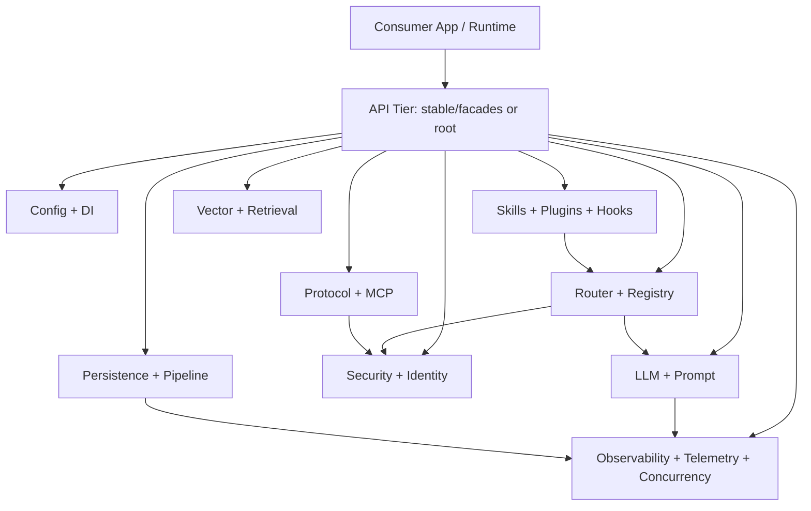

# `@dzupagent/core` Architecture

## Purpose
`@dzupagent/core` is the shared runtime foundation for DzupAgent packages. It provides the reusable primitives and orchestration building blocks used by higher-level packages (agent runtimes, server adapters, connectors, codegen flows, and integrations).

In practical terms, `core` is where the platform-level concerns live:
- model/provider resolution and failover
- typed eventing and protocol envelopes
- intent routing and capability discovery
- security policy, scanning, and output hardening
- plugin/hook and skill systems
- persistence, telemetry, and concurrency controls
- MCP and vector retrieval abstractions

## Current Implementation Snapshot
- Source files under `packages/core/src`: `261` TypeScript files
- Test files under `packages/core/src`: `72` tests
- Main public surface: `packages/core/src/index.ts` (`862` lines, broad export barrel)
- Curated API tiers:
  - `@dzupagent/core/stable` -> facades only
  - `@dzupagent/core/advanced` -> full root surface
  - specialized facade subpaths (`quick-start`, `memory`, `orchestration`, `security`)

## Design Principles Seen in Code
- Narrow-to-broad API tiers: stable facade-first API exists alongside a broad advanced/root API.
- Composable modules over monoliths: most subsystems are standalone and linked through typed contracts.
- Non-fatal integration posture: MCP/plugin/audit/safety layers often degrade gracefully instead of crashing core flows.
- In-memory reference implementations: many interfaces ship with in-memory stores for tests/dev and adapter implementations for production.
- Strongly typed contracts: message envelopes, policy rules, registry records, and vector interfaces are explicit and reusable.

## Dependency Boundaries
- Direct internal workspace dependencies:
  - `@dzupagent/memory` (heavily re-exported)
  - `@dzupagent/context` (heavily re-exported)
- Optional peer dependency:
  - `@dzupagent/memory-ipc` (guarded dynamic loading + explicit missing-dependency errors)
- External ecosystem:
  - LangChain/LangGraph (`@langchain/*`)
  - `zod` for schemas/validation
  - optional vector and observability ecosystems via adapters/dynamic imports

## Public API Topology

### Entry Points
| Entry Point | Scope | Intended Use |
|---|---|---|
| `@dzupagent/core` | Full root export surface | Internal platform work and advanced consumers needing broad control |
| `@dzupagent/core/advanced` | Alias of full root surface | Same as root, but explicit “advanced” intent |
| `@dzupagent/core/stable` | Facade namespaces only | Safer long-lived integration surface |
| `@dzupagent/core/quick-start` | Minimal bootstrap set + helper | Fast setup of event bus + model registry + container |
| `@dzupagent/core/memory` | Memory-focused facade | Memory retrieval/consolidation/lifecycle workflows |
| `@dzupagent/core/orchestration` | Routing/pipeline/protocol facade | Multi-agent orchestration and execution coordination |
| `@dzupagent/core/security` | Security-focused facade | Policy, auditing, safety, classification, redaction |

### Recommended Import Strategy
- Prefer `@dzupagent/core/stable` or explicit facades in application code.
- Use `@dzupagent/core` (or `/advanced`) for framework-level composition and custom integrations.

## High-Level Architecture


## End-to-End Runtime Flow (Typical)
1. Resolve configuration with layered loaders (`defaults -> file -> env -> runtime`).
2. Create a container and register shared singletons (`eventBus`, `registry`, etc.).
3. Classify intent via heuristic/keyword/LLM routing.
4. Select model tier (cost-aware + escalation policy if enabled).
5. Invoke model with timeout + retry; record provider health/circuit state.
6. Run security hardening on outputs (PII/secrets/content filters).
7. Emit typed events and persist run/event logs.
8. Optionally dispatch tools via MCP, protocol adapters, or sub-agent loop.
9. Track metrics/health, optionally checkpoint or transfer context across runs.

## Subsystem Architecture

### 1) Config and DI
Core modules:
- `src/config/config-loader.ts`
- `src/config/config-schema.ts`
- `src/config/container.ts`

What it does:
- Layered config resolution with deterministic precedence.
- Structural validation helpers and typed config value lookup.
- Lightweight lazy singleton DI container (`ForgeContainer`).

Key behaviors:
- `resolveConfig()` merges defaults, optional file, env (`DZIP_*`), runtime overrides.
- `ForgeContainer.register()` overwrites and clears cached instance.
- `ForgeContainer.get()` lazily instantiates and caches.

### 2) Events and Internal Messaging
Core modules:
- `src/events/event-bus.ts`
- `src/events/event-types.ts`
- `src/events/agent-bus.ts`
- `src/events/degraded-operation.ts`

What it does:
- Typed in-process event bus for lifecycle/security/registry/protocol/telemetry events.
- Separate channel-based agent-to-agent message bus.
- Standard degraded-mode signaling (`system:degraded`).

Key behaviors:
- Event handlers are fire-and-forget with error isolation.
- Wildcard subscriptions (`onAny`) support global sinks (audit, logging, replay).

### 3) LLM Runtime
Core modules:
- `src/llm/model-registry.ts`
- `src/llm/invoke.ts`
- `src/llm/retry.ts`
- `src/llm/circuit-breaker.ts`
- `src/llm/embedding-registry.ts`

What it does:
- Provider/tier model resolution with priority ordering.
- Provider failover + circuit breaker state management.
- Timeout and transient-error retry wrapper for model invocation.
- Token usage extraction across provider metadata variants.

Key behaviors:
- `ModelRegistry.getModelWithFallback()` skips open circuits and accumulates failure diagnostics.
- `invokeWithTimeout()` applies exponential backoff on transient failures.
- OpenAI reasoning-family temperature handling is guarded in factory logic.

### 4) Prompt and Template System
Core modules:
- `src/prompt/template-engine.ts`
- `src/prompt/template-resolver.ts`
- `src/prompt/template-cache.ts`
- `src/prompt/prompt-fragments.ts`

What it does:
- Template substitution with `{{var}}` + control flow (`#if`, `#unless`, `#each`, partials).
- Hierarchical template resolution via pluggable `PromptStore`.
- TTL cache for preload/bulk usage paths.
- Reusable opinionated prompt fragments for coding workflows.

### 5) Routing and Model-Tier Selection
Core modules:
- `src/router/intent-router.ts`
- `src/router/keyword-matcher.ts`
- `src/router/llm-classifier.ts`
- `src/router/cost-aware-router.ts`
- `src/router/escalation-policy.ts`

What it does:
- Multi-tier intent classification pipeline.
- Cost-aware complexity scoring to map turns to model tiers.
- Quality-driven model escalation policy on repeated low scores.

Key behaviors:
- Classification order: heuristic -> keyword -> LLM -> default.
- Complexity buckets: `simple | moderate | complex` mapped to tier routing.
- Escalation uses cooldown and consecutive-low-score thresholds.

### 6) Protocol and Cross-Agent Messaging
Core modules:
- `src/protocol/message-types.ts`
- `src/protocol/message-factory.ts`
- `src/protocol/protocol-router.ts`
- `src/protocol/internal-adapter.ts`
- `src/protocol/protocol-bridge.ts`
- A2A-specific helpers (`a2a-*`)

What it does:
- Defines strongly-typed `ForgeMessage` envelope across protocols.
- Adapts routing to target scheme via protocol adapters.
- Supports in-process agent routing and protocol bridging (including MCP<->A2A transforms).

Key behaviors:
- `ProtocolRouter` resolves adapter from `to` URI scheme.
- `InternalAdapter` uses `AgentBus` channels and correlation response channels.
- Serialization handles `Uint8Array` payload conversion safely.

### 7) Registry and Capability Discovery
Core modules:
- `src/registry/in-memory-registry.ts`
- `src/registry/capability-matcher.ts`
- `src/registry/semantic-search.ts`
- `src/registry/vector-semantic-search.ts`

What it does:
- Agent registration, update, discovery, health tracking, subscriptions.
- Capability matching with hierarchy and wildcard support.
- Optional semantic ranking (keyword fallback or vector-backed provider).

Key behaviors:
- Discovery scoring combines capability, tags, health adjustment, SLA fit.
- TTL eviction for expiring registrations.
- Event forwarding integrates with `DzupEventBus`.

### 8) Plugins and Hooks
Core modules:
- `src/plugin/plugin-types.ts`
- `src/plugin/plugin-registry.ts`
- `src/plugin/plugin-discovery.ts`
- `src/hooks/hook-runner.ts`

What it does:
- Plugin registration lifecycle and aggregation of middleware/hooks/event handlers.
- Filesystem manifest discovery + dependency-aware ordering.
- Hook execution with failure isolation.

Key behaviors:
- Duplicate plugin names are rejected.
- Discovery scans default local directories and supports builtin manifests.
- Topological sort detects plugin dependency cycles.

### 9) Skills System
Core modules:
- `src/skills/skill-loader.ts`
- `src/skills/skill-registry.ts`
- `src/skills/skill-directory-loader.ts`
- `src/skills/skill-manager.ts`
- `src/skills/skill-learner.ts`
- `src/skills/skill-chain.ts`
- `src/skills/agents-md-parser.ts`
- `src/skills/hierarchical-walker.ts`

What it does:
- Discover/load skills from `SKILL.md` or `.skill.json`.
- Manage skill content lifecycle with atomic writes and safety scan.
- Search/rank/inject skills into prompts.
- Learn execution quality metrics for optimization candidates.
- Parse layered `AGENTS.md`/`CLAUDE.md` instructions.

### 10) Security Stack
Core modules:
- `src/security/risk-classifier.ts`
- `src/security/secrets-scanner.ts`
- `src/security/pii-detector.ts`
- `src/security/output-pipeline.ts`
- `src/security/policy/*`
- `src/security/audit/*`
- `src/security/monitor/*`
- `src/security/memory/*`
- `src/security/output/*`
- `src/security/classification/*`

What it does:
- Tool risk tiering and policy gating.
- Secrets/PII scanning and output sanitization pipeline.
- Zero-trust policy evaluator with deny-overrides + default-deny.
- Audit trail with chain integrity verification.
- Safety monitoring and memory-poisoning defense.
- Data sensitivity classification and classification-aware redaction.

Notable semantics:
- Policy evaluator is synchronous/pure and suitable for hot-path enforcement.
- Policy translator exists for authoring support only, not enforcement path.
- Security layers generally fail soft (non-fatal monitoring/audit behavior).

### 11) Identity and Delegation
Core modules:
- `src/identity/forge-uri.ts`
- `src/identity/key-manager.ts`
- `src/identity/identity-resolver.ts`
- `src/identity/delegation-manager.ts`
- `src/identity/capability-checker.ts`
- `src/identity/trust-scorer.ts`

What it does:
- Canonical identity URI parsing/building and resolver strategies.
- Key generation/signing/verification workflows.
- Delegation token issuing, chain validation, cascading revocation.
- Capability authorization combining delegation, direct caps, and role mappings.
- Trust scoring based on reliability/performance/cost/delegation/recency signals.

### 12) MCP Integration
Core modules:
- `src/mcp/mcp-client.ts`
- `src/mcp/mcp-server.ts`
- `src/mcp/mcp-tool-bridge.ts`
- `src/mcp/mcp-reliability.ts`
- `src/mcp/mcp-security.ts`
- `src/mcp/mcp-resources.ts`
- `src/mcp/mcp-sampling*.ts`

What it does:
- Client-side MCP server connectivity (http/sse/stdio), discovery, invocation.
- Deferred tool loading for large toolsets.
- Bridge MCP tool descriptors to LangChain tools and back.
- Reliability wrapper with heartbeat/circuit/cache capabilities.
- Resource discovery/read/subscribe and sampling request handlers.

### 13) Vector and Semantic Retrieval
Core modules:
- `src/vectordb/types.ts`
- `src/vectordb/semantic-store.ts`
- `src/vectordb/in-memory-vector-store.ts`
- `src/vectordb/auto-detect.ts`
- `src/vectordb/embeddings/*`
- `src/vectordb/adapters/*`

What it does:
- Provider-agnostic vector store interface and metadata filtering.
- Text-centric semantic wrapper (`SemanticStore`) over embedding + vector store.
- In-memory store for tests/dev and adapters for external providers.
- Embedding provider auto-detection from environment variables.

### 14) Persistence and Pipeline
Core modules:
- `src/persistence/in-memory-store.ts`
- `src/persistence/event-log.ts`
- `src/persistence/run-store.ts`
- `src/persistence/in-memory-run-store.ts`
- `src/persistence/checkpointer.ts`
- `src/pipeline/*`

What it does:
- Run and event persistence with retention controls.
- Event-log sink for capturing bus events into replayable streams.
- Pipeline definitions/schemas/serialization/checkpoint contracts.
- Simple pipeline auto-layout for visualization tooling.

### 15) Sub-Agent Execution
Core modules:
- `src/subagent/subagent-spawner.ts`
- `src/subagent/subagent-types.ts`
- `src/subagent/file-merge.ts`

What it does:
- Spawn isolated child agent executions.
- Optional ReAct loop with tool calls and token usage tracking.
- Merge child file outputs back into parent virtual FS.

### 16) Observability, Concurrency, Output, Telemetry, i18n
Core modules:
- `src/observability/*`
- `src/concurrency/*`
- `src/output/format-adapter.ts`
- `src/telemetry/trace-propagation.ts`
- `src/i18n/locale-manager.ts`

What it does:
- Metrics collector and aggregate health checks.
- Semaphore and keyed concurrency pool with drain semantics.
- Output format validation/detection helpers.
- Lightweight W3C-style trace context propagation (without OTel hard dependency).
- Locale manager with fallback string resolution and interpolation.

### 17) Optional Memory IPC Bridge
Core module:
- `src/memory-ipc.ts`

What it does:
- Convenience re-export and runtime guard layer around optional `@dzupagent/memory-ipc`.
- Provides explicit missing-dependency errors and export integrity checks.

## Feature Inventory (Implementation-Oriented)
| Domain | Core Feature | Description |
|---|---|---|
| API Surface | Tiered exports | Stable curated facades plus broad advanced/root surface |
| Bootstrapping | `createQuickAgent` | One-call setup for container + bus + registry |
| LLM | Provider fallback | Priority-based fallback with circuit breaker state |
| LLM | Invocation guardrails | Timeout + transient retry + token usage extraction |
| Prompting | Templating engine | Variable interpolation, conditionals, loops, partials |
| Routing | Intent + complexity routing | Heuristic/keyword/LLM classification + tier recommendation |
| Protocol | `ForgeMessage` envelope | Typed protocol-agnostic inter-agent message contract |
| Protocol | Adapter routing | URI scheme-based adapter resolution and stream routing |
| Registry | Capability scoring | Hierarchical capability match + health/SLA-aware discovery |
| Plugins | Dynamic registration | Hook/middleware/event handler composition |
| Skills | File-driven skills | `SKILL.md`/JSON loading, registry/search, lifecycle ops |
| Security | Output hardening | PII/secrets scanning + configurable sanitize pipeline |
| Security | Policy engine | Default-deny + deny-overrides zero-trust evaluator |
| Security | Audit and safety | Event-driven compliance logging + safety monitor rules |
| Identity | Delegation chain | Signed token chains with scope narrowing + revocation |
| MCP | Tool bridge | MCP tool descriptors converted to LangChain tools |
| Vector | Semantic store | Text-first API over embeddings and vector backends |
| Persistence | Run/event stores | In-memory stores + retention limits + event sink |
| Pipeline | Definition model | Typed nodes/edges + serialization + visualization layout |
| Subagents | ReAct spawning | Iterative tool loop and parent-file merge |
| Operations | Metrics/health | Lightweight collector + subsystem health aggregation |

## How To Use `@dzupagent/core`

### A) Fast Start (Facade-First)
```ts
import { createQuickAgent, invokeWithTimeout } from '@dzupagent/core/quick-start'
import { HumanMessage } from '@langchain/core/messages'

const { registry, eventBus } = createQuickAgent({
  provider: 'openai',
  apiKey: process.env.OPENAI_API_KEY!,
  chatModel: 'gpt-4o-mini',
})

eventBus.on('agent:failed', (e) => {
  console.error('agent failed', e.errorCode, e.message)
})

const model = registry.getModel('chat')
const response = await invokeWithTimeout(model, [new HumanMessage('Summarize this repo architecture')])
```

### B) Full Composition (Advanced)
```ts
import {
  createContainer,
  createEventBus,
  ModelRegistry,
  IntentRouter,
  KeywordMatcher,
  CostAwareRouter,
  createDefaultPipeline,
} from '@dzupagent/core'

const container = createContainer()
const eventBus = createEventBus()
const registry = new ModelRegistry()

registry.addProvider({
  provider: 'anthropic',
  apiKey: process.env.ANTHROPIC_API_KEY!,
  priority: 1,
  models: {
    chat: { name: 'claude-haiku-4-20250514', maxTokens: 4096 },
    codegen: { name: 'claude-sonnet-4-20250514', maxTokens: 8192 },
    reasoning: { name: 'claude-sonnet-4-20250514', maxTokens: 8192 },
  },
})

const keyword = new KeywordMatcher()
  .addPattern(/migrate|refactor|schema/i, 'code_change')
  .addPattern(/explain|summarize/i, 'analysis')

const router = new IntentRouter({
  keywordMatcher: keyword,
  defaultIntent: 'general',
})

const costRouter = new CostAwareRouter({ intentRouter: router })
const securityPipeline = createDefaultPipeline({ enablePII: true, enableSecrets: true })

container.register('eventBus', () => eventBus)
container.register('registry', () => registry)
container.register('router', () => costRouter)
container.register('outputPipeline', () => securityPipeline)
```

### C) Event Log + Run Store Integration
```ts
import { createEventBus, InMemoryEventLog, EventLogSink, InMemoryRunStore } from '@dzupagent/core'

const bus = createEventBus()
const logStore = new InMemoryEventLog({ maxRuns: 500, maxEventsPerRun: 2000 })
const sink = new EventLogSink(logStore)
const runStore = new InMemoryRunStore({ maxRuns: 1000, maxLogsPerRun: 500 })

const run = await runStore.create({ agentId: 'planner', input: { prompt: 'plan feature X' } })
const stopCapture = sink.attach(bus, run.id)

bus.emit({ type: 'agent:started', agentId: 'planner', runId: run.id })
// ... run workflow ...
bus.emit({ type: 'agent:completed', agentId: 'planner', runId: run.id, durationMs: 3200 })

stopCapture()
```

### D) Policy Enforcement + Audit Trail
```ts
import {
  PolicyEvaluator,
  InMemoryPolicyStore,
  InMemoryAuditStore,
  ComplianceAuditLogger,
} from '@dzupagent/core/security'
import { createEventBus } from '@dzupagent/core'

const policyStore = new InMemoryPolicyStore()
const evaluator = new PolicyEvaluator()
const auditStore = new InMemoryAuditStore()
const auditLogger = new ComplianceAuditLogger({ store: auditStore })
const bus = createEventBus()

auditLogger.attach(bus)

const decision = evaluator.evaluate(policySet, {
  principal: { type: 'agent', id: 'agent-1', roles: ['operator'] },
  action: 'runs.create',
  resource: 'project/demo',
  environment: { region: 'eu-west-1' },
})

if (decision.effect === 'deny') {
  bus.emit({
    type: 'policy:denied',
    policySetId: policySet.id,
    action: 'runs.create',
    principalId: 'agent-1',
    reason: decision.decidingRule?.description ?? 'policy denied',
  })
}
```

### E) MCP Tools in Agent Tooling
```ts
import { MCPClient, mcpToolsToLangChain } from '@dzupagent/core'

const mcp = new MCPClient()
mcp.addServer({
  id: 'local-tools',
  name: 'Local Tools',
  url: 'http://localhost:8787',
  transport: 'http',
  maxEagerTools: 20,
})

await mcp.connectAll()
const langChainTools = mcpToolsToLangChain(mcp)
```

### F) Semantic Retrieval
```ts
import {
  createOpenAIEmbedding,
  InMemoryVectorStore,
  SemanticStore,
} from '@dzupagent/core'

const embedding = createOpenAIEmbedding({
  apiKey: process.env.OPENAI_API_KEY!,
  model: 'text-embedding-3-small',
})

const vectorStore = new InMemoryVectorStore()
const semantic = new SemanticStore({ embedding, vectorStore })

await semantic.ensureCollection('docs')
await semantic.upsert('docs', [
  { id: 'a', text: 'Policy evaluator uses default-deny and deny-overrides.' },
  { id: 'b', text: 'Protocol router dispatches by URI scheme.' },
])

const results = await semantic.search('docs', 'how are policies enforced?', 3)
```

## Extensibility Points
- Custom model providers: `ModelRegistry.setFactory(...)`
- Plugin ecosystem: `PluginRegistry.register(...)` and manifest discovery
- Tool governance: `ToolGovernance` custom validator/audit hooks
- Policy authoring: `PolicyTranslator` with your LLM function
- Protocol adapters: implement `ProtocolAdapter`
- Vector backends: implement `VectorStore`
- Skill persistence and optimization loops: `SkillManager` + `SkillLearner`
- Health and metrics integrations: `HealthAggregator` + `MetricsCollector`

## Operational Guidance
- Prefer facade imports for application code to limit coupling to broad internals.
- Use in-memory implementations for tests and local dev only.
- Treat `mcp`, `plugin`, and optional dependency layers as degraded-capable; check status APIs.
- Enable output sanitization by default in user-facing response paths.
- Use event bus sinks (audit/log/replay) early; this package is strongly event-centric.
- For high-volume workloads, move from in-memory vector/persistence to external adapters/stores.

## Feature-to-Test Coverage Matrix (Current)
The following matrix links implemented feature areas to the current tests in `packages/core/src`. This is based on the present repository state and is intended to make feature coverage explicit for updates.

| Feature Area | What Is Covered | Related Tests |
|---|---|---|
| API tiers and facade stability | export surface and namespace structure | `src/__tests__/facades.test.ts`, `src/__tests__/core.integration.test.ts` |
| Config resolution and validation | layered config loading, schema validation, boundary handling | `src/__tests__/config-loader.test.ts`, `src/__tests__/config.test.ts`, `src/__tests__/boundary.test.ts` |
| DI/Event integration | event bus + sink + run store integration flow | `src/__tests__/core.integration.test.ts` |
| Event bus and event log | subscribe/emit semantics and run event persistence | `src/__tests__/event-bus.test.ts`, `src/__tests__/event-log.test.ts`, `src/__tests__/degraded-operation.test.ts` |
| LLM registry and resilience | provider ordering, fallback, middleware, circuit behavior | `src/__tests__/model-registry.test.ts`, `src/__tests__/circuit-breaker.test.ts`, `src/__tests__/extract-token-usage.test.ts` |
| Router + model-tier policy | complexity routing and escalation recommendation logic | `src/__tests__/cost-aware-router.test.ts`, `src/__tests__/escalation-policy.test.ts` |
| Prompt/template engine | variable extraction/substitution and template behavior | `src/__tests__/template-engine.test.ts` |
| Security scanning + sanitization | secrets/PII detection, output pipeline, classification | `src/__tests__/secrets-scanner.test.ts`, `src/__tests__/pii-detector.test.ts`, `src/__tests__/output-pipeline.test.ts`, `src/__tests__/data-classification.test.ts` |
| Security governance + monitoring | policy engine, audit trail, safety monitor, tool controls | `src/__tests__/policy-engine.test.ts`, `src/__tests__/compliance-audit.test.ts`, `src/__tests__/security-monitor.test.ts`, `src/__tests__/tool-governance.test.ts` |
| Tool performance feedback | tool success/latency ranking and aggregation | `src/__tests__/tool-stats-tracker.test.ts` |
| Identity and trust | identity models, resolvers, signing, delegation, trust scoring | `src/identity/__tests__/identity.test.ts`, `src/identity/__tests__/resolver.test.ts`, `src/identity/__tests__/signing.test.ts`, `src/identity/__tests__/delegation.test.ts`, `src/identity/__tests__/trust-scorer.test.ts` |
| Protocol stack | message schemas, adapters, router, bridge, serialization, A2A flows | `src/protocol/__tests__/protocol.test.ts`, `src/protocol/__tests__/adapters.test.ts`, `src/protocol/__tests__/bridge.test.ts`, `src/protocol/__tests__/serialization.test.ts`, `src/protocol/__tests__/a2a-sse.test.ts`, `src/protocol/__tests__/a2a-json-rpc.test.ts`, `src/protocol/__tests__/a2a-push-notification.test.ts` |
| MCP core and reliability | MCP security hardening, reliability manager, resources, sampling | `src/__tests__/mcp-security.test.ts`, `src/__tests__/mcp-reliability.test.ts`, `src/mcp/__tests__/mcp-resources.test.ts`, `src/mcp/__tests__/mcp-sampling.test.ts` |
| Registry and discovery | in-memory registry behavior, semantic and vector semantic search | `src/registry/__tests__/registry.test.ts`, `src/registry/__tests__/semantic-search.test.ts`, `src/registry/__tests__/vector-semantic-search.test.ts`, `src/__tests__/registry-idcounter.test.ts` |
| Skills and AGENTS.md parsing | skill loading/registry and agents-md parser behavior | `src/__tests__/skill-loader.test.ts`, `src/__tests__/skill-registry.test.ts`, `src/__tests__/agents-md-parser.test.ts` |
| Sub-agent orchestration | sub-agent spawn loop and merge behavior | `src/__tests__/subagent-spawner.test.ts` |
| Concurrency primitives | semaphore/pool behavior and drain semantics | `src/__tests__/concurrency.test.ts`, `src/__tests__/pool-drain.test.ts` |
| Persistence/run context | run stores and context transfer persistence | `src/__tests__/in-memory-store.test.ts`, `src/__tests__/run-store.test.ts`, `src/__tests__/run-context-transfer.test.ts` |
| Pipeline model | pipeline schema/validation/runtime and layout generation | `src/pipeline/__tests__/pipeline.test.ts`, `src/__tests__/pipeline-layout.test.ts` |
| Formats and output adapters | format conversions/parsers and output format detection | `src/formats/__tests__/formats.test.ts`, `src/__tests__/format-adapter.test.ts` |
| Vector DB abstraction and adapters | core vector types/store plus adapter-specific behavior | `src/vectordb/__tests__/types.test.ts`, `src/vectordb/__tests__/in-memory-vector-store.test.ts`, `src/vectordb/__tests__/semantic-store.test.ts`, `src/vectordb/__tests__/embeddings.test.ts`, `src/vectordb/__tests__/qdrant-adapter.test.ts`, `src/vectordb/__tests__/pinecone-adapter.test.ts`, `src/vectordb/__tests__/pgvector-adapter.test.ts`, `src/vectordb/__tests__/chroma-adapter.test.ts`, `src/__tests__/lancedb-adapter.test.ts`, `src/__tests__/vectordb/turbopuffer-adapter.test.ts` |
| Telemetry and localization | trace propagation and locale manager behavior | `src/__tests__/trace-propagation.test.ts`, `src/__tests__/locale-manager.test.ts` |
| Middleware cost attribution | attribution and reporting logic | `src/middleware/__tests__/cost-attribution.test.ts` |
| Optional memory-ipc guards | dependency and boundary guards for optional package | `src/__tests__/memory-ipc-guard.test.ts`, `src/__tests__/memory-ipc-boundary.test.ts` |
| Error model | structured `ForgeError` behavior | `src/__tests__/forge-error.test.ts` |

## Testing Posture
The package includes extensive module-focused tests plus integration tests for cross-module wiring:
- event bus + event log + run store lifecycle integration
- facade export stability and curated surface checks
- model registry fallback and middleware behavior
- policy evaluator semantics (default-deny and deny-overrides)
- MCP reliability/security/resource/sampling behaviors
- protocol serialization/bridge/router correctness
- vector adapter and semantic store behavior

## Notes
- This file documents the implementation as currently present in `packages/core/src`.
- There is also an additional architecture summary under `packages/core/docs/ARCHITECTURE.md`; this document is the broader implementation-oriented reference requested for package-root discoverability.
