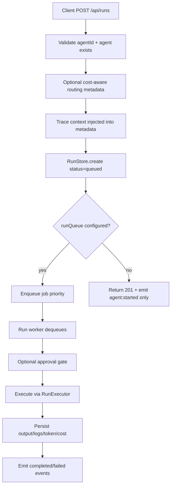

# @dzupagent/server Architecture

This document is a deep architecture and usage reference for `packages/server`.
It covers features, runtime flow, integration points, cross-package usage in this monorepo, and current test posture.

Analysis snapshot:
- Date: `2026-04-04`
- Package: `@dzupagent/server`
- Source baseline: `packages/server/src/**`
- Test baseline: `yarn workspace @dzupagent/server test` and `yarn workspace @dzupagent/server test:coverage`

## 1) Purpose and Scope

`@dzupagent/server` is the runtime host and transport layer for DzupAgent systems.
It provides:
- A Hono app factory (`createForgeApp`) for HTTP APIs.
- Optional queue-backed run execution wiring.
- Realtime event fan-out (SSE + WebSocket bridge/control primitives).
- Security middleware (auth, rate limiting, tenant scoping, RBAC, identity/capabilities).
- Optional memory, eval, benchmark, deploy-confidence, learning, and playground routes.
- Persistence implementations (Postgres via Drizzle + in-memory stores).
- Ops-facing utilities (doctor, scorecard, deploy helpers, Prometheus collector, graceful shutdown).

In monorepo terms, this is an upper-layer package depending on:
- `@dzupagent/core` (contracts + in-memory primitives + event bus + model registry types)
- `@dzupagent/agent` (agent runtime execution)
- `@dzupagent/memory-ipc` (memory route bridging)
- `@dzupagent/evals` (benchmark/eval orchestration)

## 2) Architectural Position in the Monorepo

Layer boundary (enforced by codegen guardrail):
- `packages/codegen/src/guardrails/rules/layering-rule.ts` defines `@dzupagent/server` as top layer.
- Lower-level packages should not import from it.

Practical implication:
- Core contracts live in `@dzupagent/core`.
- `@dzupagent/server` provides network/runtime adapters around those contracts.

## 3) Module Topology

Primary internal modules:
- `src/app.ts`: central composition root (`createForgeApp`).
- `src/routes/*`: HTTP route groups.
- `src/runtime/*`: run execution, worker, tool resolution, quota, consolidation.
- `src/queue/*`: queue abstraction (`InMemoryRunQueue`, `BullMQRunQueue`).
- `src/middleware/*`: auth/rate/identity/RBAC/capability/tenant.
- `src/events/*` + `src/ws/*`: realtime event gateway + WS bridge/control.
- `src/persistence/*`: Postgres stores, schemas, vector ops, trace/eval/benchmark stores.
- `src/services/*`: eval and benchmark orchestrators.
- `src/deploy/*`: deployment confidence/history/signals/docker helpers.
- `src/registry/*`: agent health monitor.
- `src/security/*`: incident-response engine.
- `src/notifications/*`: channels + notification dispatcher.
- `src/triggers/*`: cron/webhook/chain trigger manager.
- `src/platforms/*`: Lambda/Vercel/Cloudflare adapters.
- `src/cli/*`: doctor, dev command, plugin/memory/vector/config/marketplace/scorecard helpers.
- `src/docs/*`: doc generator and renderers (agent/tool/pipeline).

Public API:
- Exposed via `src/index.ts` (broad export surface: app, routes, middleware, runtime, deploy, registry, ws, cli, docs).

## 4) Runtime Composition (`createForgeApp`)

`createForgeApp(config)` in `src/app.ts` is the central wiring point.

Required config:
- `runStore`
- `agentStore`
- `eventBus`
- `modelRegistry`

Important defaults and behavior:
- Event gateway defaults to `InMemoryEventGateway(eventBus)` if not supplied.
- Run executor defaults to `createDzupAgentRunExecutor({ fallback: createDefaultRunExecutor(modelRegistry) })`.
- If `runQueue` is provided, `startRunWorker(...)` is started once per queue instance (tracked by `WeakSet`).

Middleware order:
1. CORS
2. Auth (optional)
3. Rate limiting (optional)
4. Tenant scope (optional)
5. RBAC (optional)
6. Shutdown guard on `POST /api/runs` (optional)
7. Request metrics instrumentation (optional)
8. Global error handler

Mounted routes:
- Always:
  - `/api/health` (liveness/readiness + metrics json + routing stats)
  - `/api/runs`
  - `/api/agent-definitions`
  - `/api/agents` (deprecated compatibility alias)
  - `/api/runs/:id/approve|reject`
  - `/api/events/stream`
- Conditional:
  - `/api/registry` via `registry`
  - `/api/runs/:id/messages` via `traceStore`
  - `/api/memory/*` + `/api/memory-browse/*` via `memoryService`
  - `/api/memory/health` via `memoryHealth`
  - `/api/deploy/*` via `deploy`
  - `/api/learning/*` via `learning`
  - `/api/benchmarks/*` via `benchmark`
  - `/api/evals/*` via `evals`
  - `/playground/*` via `playground.distDir`
  - `/metrics` only when `metrics instanceof PrometheusMetricsCollector`
  - `/api/health/consolidation` when consolidation + shutdown are configured

Not mounted by default, but exported for manual mounting:
- Registry routes (`createRegistryRoutes`)
- A2A routes (`createA2ARoutes`)
- Memory sync route helpers (`createMemorySyncRoutes`, `createMemorySyncHandler`)

## 5) Core Execution Flows

### 5.1 Run Lifecycle Flow



Key details:
- `POST /api/runs` returns `202` when queued, `201` when no queue is configured.
- Approval flow is event-driven (`approval:requested`, `approval:granted`, `approval:rejected`).
- Worker handles cancellation, failure, and terminal state protection.
- Optional trace store captures `user_input`, system/output, and completion markers.
- Optional reflection and retrieval-feedback hooks execute after successful completion.

### 5.2 Realtime Event Flow

```mermaid
flowchart LR
    EB[DzupEventBus] --> EG[EventGateway]
    EG --> SSE1[/api/events/stream]
    EB --> SSE2[/api/runs/:id/stream]
    EG --> WB[EventBridge]
    WB --> WS[WS clients]
    WS --> CP[Control Protocol subscribe/unsubscribe]
```

Capabilities:
- Global SSE stream with filtering by `runId`, `agentId`, `types`.
- Per-run SSE stream (`/api/runs/:id/stream`).
- WS bridge with client filter updates and scoped authorization utilities.
- Overflow controls in event gateway (`drop_oldest`, `drop_new`, `disconnect`).

### 5.3 Security Flow

1. Transport auth (`authMiddleware`) validates bearer token/api key metadata.
2. Identity resolution (`identityMiddleware`) can map credentials to `ForgeIdentity`.
3. Capability checks (`capabilityGuard`) can enforce fine-grained capability claims.
4. Tenant scoping (`tenantScopeMiddleware`) enforces tenant identity for non-health routes.
5. RBAC (`rbacMiddleware`) maps route/method to permission tuple.
6. Rate limiter protects `/api/*` except health endpoints.

## 6) Feature Inventory (Description + Enablement + Usage)

### 6.1 Base API Plane

Feature: Agent CRUD and run lifecycle APIs.
- Files: `routes/agents.ts`, `routes/runs.ts`, `routes/approval.ts`, `routes/health.ts`
- Default in app: Yes
- Usage:
  - `GET/POST/PATCH/DELETE /api/agent-definitions`
  - `GET/POST/PATCH/DELETE /api/agents` (deprecated compatibility alias)
  - `POST /api/runs`
  - `GET /api/runs`, `GET /api/runs/:id`, `GET /api/runs/:id/logs`, `GET /api/runs/:id/trace`
  - `POST /api/runs/:id/cancel|approve|reject`

Feature: Routing quality/cost statistics.
- File: `routes/routing-stats.ts`
- Default in app: Yes (`/api/health/routing`)
- Usage: Operational insight into router tiering, reasons, complexity, and reflection quality aggregates.

### 6.2 Async Run Execution and Queueing

Feature: Queue abstraction and workers.
- Files: `queue/run-queue.ts`, `queue/bullmq-run-queue.ts`, `runtime/run-worker.ts`
- Enablement: provide `runQueue` in `ForgeServerConfig`
- Notes:
  - In-memory queue supports retries, DLQ, cancellation.
  - BullMQ queue supports Redis-backed production workloads.
  - Worker instrumentation emits lifecycle logs and events.

Feature: Executors.
- Files: `runtime/dzip-agent-run-executor.ts`, `runtime/default-run-executor.ts`
- Default behavior: DzupAgent executor with fallback default LLM/simple text executor.
- Usage:
  - Streaming deltas via `agent:stream_delta` events.
  - Tool-call/tool-result logging and metadata enrichment.

### 6.3 Realtime Transport

Feature: SSE event stream.
- File: `routes/events.ts`
- Default in app: Yes
- Usage:
  - `GET /api/events/stream?runId=...&agentId=...&types=...`
  - heartbeat every 15 seconds.

Feature: WS bridge and control protocol.
- Files: `ws/event-bridge.ts`, `ws/control-protocol.ts`, `ws/*`
- Default in app: No direct mount; exported for host runtime integration.
- Usage:
  - Add client to bridge, then apply runtime filter updates with control messages.

### 6.4 Memory and Learning Plane

Feature: Memory import/export/schema + analytics.
- File: `routes/memory.ts`
- Enablement: `memoryService`
- Endpoints:
  - `POST /api/memory/export`
  - `POST /api/memory/import`
  - `GET /api/memory/schema`
  - `GET /api/memory/analytics/*`

Feature: Memory browsing.
- File: `routes/memory-browse.ts`
- Enablement: `memoryService`
- Endpoint: `GET /api/memory-browse/:namespace`

Feature: Memory health.
- File: `routes/memory-health.ts`
- Enablement: `memoryHealth.retriever`
- Endpoint: `GET /api/memory/health`

Feature: Learning dashboard APIs.
- File: `routes/learning.ts`
- Enablement: `learning.memoryService`
- Endpoints include:
  - `/dashboard`, `/overview`
  - `/trends/quality`, `/trends/cost`
  - `/feedback`, `/feedback/stats`
  - `/skill-packs/*`, `/lessons`, `/rules`

### 6.5 Evaluation and Benchmarking

Feature: Benchmark routes.
- Files: `routes/benchmarks.ts`, `services/benchmark-orchestrator.ts`
- Enablement: `benchmark.executeTarget`
- Endpoints:
  - `GET/POST /api/benchmarks/runs`
  - `GET /api/benchmarks/runs/:id`
  - `POST /api/benchmarks/compare`
  - `GET/PUT /api/benchmarks/baselines`

Feature: Eval routes with queue/recovery support.
- Files: `routes/evals.ts`, `services/eval-orchestrator.ts`
- Enablement: `evals` config
- Modes:
  - Active mode when execution target exists
  - Read-only mode when configured without execution target (`allowReadOnlyMode`)

### 6.6 Deployment and Operations

Feature: Deploy confidence/history APIs.
- Files: `routes/deploy.ts`, `deploy/*`
- Enablement: `deploy.historyStore` (+ optional thresholds/checkers)
- Endpoints:
  - `GET /api/deploy/confidence`
  - `POST /api/deploy/record`
  - `GET /api/deploy/history`
  - `PATCH /api/deploy/:id/outcome`

Feature: Graceful shutdown and drain orchestration.
- File: `lifecycle/graceful-shutdown.ts`
- Enablement: `shutdown` config + optional integration hooks.

Feature: Prometheus exposition.
- Files: `metrics/prometheus-collector.ts`, `routes/metrics.ts`
- Enablement: `metrics: new PrometheusMetricsCollector()`
- Endpoint: `GET /metrics`

Feature: Health/readiness metrics JSON.
- File: `routes/health.ts`
- Default in app: Yes

### 6.7 Registry and A2A (Manual Mount)

Feature: Registry APIs and health monitoring.
- Files: `routes/registry.ts`, `persistence/postgres-registry.ts`, `registry/health-monitor.ts`
- Default in app: No
- Usage: manual route mount for service discovery and registration.

Feature: A2A routes (REST + JSON-RPC).
- Files: `routes/a2a.ts`, `a2a/*`
- Default in app: No
- Usage: manual route mount for task submission/retrieval and `.well-known/agent.json`.

### 6.8 Other Exported Runtime Features

Feature: Notifications (`Notifier`, webhook/console channels).
- Files: `notifications/*`
- Mounting: programmatic integration.

Feature: Trigger manager (cron/webhook/chain).
- Files: `triggers/*`
- Mounting: programmatic integration.

Feature: Incident response engine.
- File: `security/incident-response.ts`
- Mounting: attach to event bus, manage kill/quarantine/disable playbooks.

Feature: Platform adapters.
- Files: `platforms/lambda.ts`, `platforms/vercel.ts`, `platforms/cloudflare.ts`
- Usage: wrap Hono app for target runtime.

Feature: CLI and docs generation.
- Files: `cli/*`, `docs/*`
- Usage: diagnostics and generated operational docs.

## 7) Usage Examples

### 7.1 Minimal runnable server with queue execution

```ts
import {
  createForgeApp,
  InMemoryRunQueue,
  PrometheusMetricsCollector,
} from '@dzupagent/server'
import {
  InMemoryRunStore,
  InMemoryAgentStore,
  ModelRegistry,
  createEventBus,
} from '@dzupagent/core'

const app = createForgeApp({
  runStore: new InMemoryRunStore(),
  agentStore: new InMemoryAgentStore(),
  eventBus: createEventBus(),
  modelRegistry: new ModelRegistry(),
  runQueue: new InMemoryRunQueue({ concurrency: 4 }),
  corsOrigins: ['http://localhost:5173'],
  auth: {
    mode: 'api-key',
    validateKey: async (token) =>
      token === process.env['DZIP_API_KEY'] ? { keyId: 'local-dev' } : null,
  },
  rateLimit: {
    maxRequests: 60,
    windowMs: 60_000,
    headerPrefix: 'X-RateLimit',
  },
  metrics: new PrometheusMetricsCollector(),
})

export default { port: 4000, fetch: app.fetch }
```

### 7.2 Adding memory, evals, benchmarks, deploy confidence

```ts
const app = createForgeApp({
  runStore,
  agentStore,
  eventBus,
  modelRegistry,
  runQueue,
  memoryService,
  memoryHealth: { retriever },
  learning: { memoryService },
  benchmark: {
    executeTarget: async (targetId, input) => executeAgent(targetId, input),
  },
  evals: {
    suites: EVAL_SUITES,
    executeTarget: async (input) => executeEvalTarget(input),
  },
  deploy: {
    historyStore: deploymentHistoryStore,
    defaultEnvironment: 'production',
  },
})
```

### 7.3 Manual mount for Registry + A2A routes

```ts
import { createForgeApp, createRegistryRoutes, createA2ARoutes } from '@dzupagent/server'

const app = createForgeApp(baseConfig)

app.route('/api/registry', createRegistryRoutes({ registry }))
app.route('/', createA2ARoutes({
  agentCard,
  taskStore,
  onTaskSubmitted: executeA2ATask,
}))
```

### 7.4 WebSocket bridge usage pattern

```ts
import { EventBridge, createWsControlHandler } from '@dzupagent/server'

const bridge = new EventBridge(eventBus)

// On socket connection:
bridge.addClient(ws, { runId: 'run-123' })
const onControlMessage = createWsControlHandler(bridge, ws, {
  requireScopedSubscription: true,
})
```

## 8) Cross-Package References and Usage in This Monorepo

### 8.1 Direct package imports

Direct imports of `@dzupagent/server` were found in:
- `packages/create-dzupagent/src/templates/server.ts`
- `packages/create-dzupagent/src/templates/full-stack.ts`
- `packages/create-dzupagent/src/templates/secure-internal-assistant.ts`
- `packages/create-dzupagent/src/templates/production-saas-agent.ts`

Usage pattern:
- These templates scaffold apps around `createForgeApp(...)`.
- They represent the primary first-party bootstrap path for external adopters.

### 8.2 API-level consumers

`@dzupagent/playground` consumes server routes over HTTP/SSE:
- Agent APIs: `packages/playground/src/stores/agent-store.ts`
- Run APIs: `packages/playground/src/stores/run-store.ts`, `chat-store.ts`
- Event stream: `packages/playground/src/App.vue` (`/api/events/stream`)
- Trace replay: `packages/playground/src/composables/useTraceReplay.ts`

### 8.3 Dependency boundaries

- `@dzupagent/core` is the shared contract layer used by server stores, events, and middleware types.
- `@dzupagent/agent` is used by `createDzupAgentRunExecutor`.
- `@dzupagent/memory-ipc` powers `memory` and `memory-browse` route handlers.
- `@dzupagent/evals` powers benchmark and eval orchestrators.

## 9) Test Coverage and Quality Posture

### 9.1 Executed test commands

- `yarn workspace @dzupagent/server test`
- `yarn workspace @dzupagent/server test:coverage`

### 9.2 Current test results

- Test files: `52` total (`51` passed, `1` skipped)
- Test cases: `641` total (`634` passed, `7` skipped)
- Skipped suite observed: `src/__tests__/bullmq-e2e.test.ts` (7 skipped)

### 9.3 Coverage summary (from `packages/server/coverage/coverage-summary.json`)

- Statements: `75.97%`
- Lines: `75.97%`
- Functions: `77.31%`
- Branches: `74.77%`

Configured thresholds in `packages/server/vitest.config.ts`:
- statements `>= 70`
- branches `>= 60`
- functions `>= 60`
- lines `>= 70`

Current package coverage exceeds configured thresholds.

### 9.4 High and low coverage areas

Higher confidence areas (examples):
- `runtime/run-worker.ts` (~89.8% lines)
- `routes/learning.ts` (~97.3% lines)
- `queue/run-queue.ts` (~93.5% lines)
- `metrics/prometheus-collector.ts` (100% lines)
- `security/incident-response.ts` (~93.5% lines)

Lower confidence areas (examples):
- `deploy/confidence-calculator.ts` (~12.6% lines)
- `routes/a2a.ts` (~18.6% lines)
- `routes/deploy.ts` (~22.5% lines)
- `routes/events.ts` (~25.7% lines)
- `triggers/trigger-manager.ts` (~27.4% lines)
- `persistence/postgres-stores.ts` (~37.0% lines)
- `lifecycle/graceful-shutdown.ts` (~43.4% lines)

### 9.5 Practical interpretation

Strengths:
- Core run pipeline behavior is heavily exercised.
- Middleware, WS control utilities, queue mechanics, and memory/learning routes are broadly tested.
- Integration-style tests exist (`e2e-run-pipeline`, eval lease recovery, mcp integration).

Risks / opportunities:
- Deploy confidence stack is feature-rich but comparatively under-tested.
- A2A route surface is large with limited route-level coverage.
- Some lifecycle/platform/persistence modules have lower functional-path coverage.

## 10) Key Design Decisions and Operational Notes

- Queue is effectively required for real async execution; without `runQueue`, run creation does not process via worker path.
- Eventing is first-class: run and tool progression are emitted and streamable.
- Secure defaults can intentionally block all CORS when enabled without explicit origins.
- Shutdown integration includes reject-new-runs behavior and optional scheduler drain hooks.
- Many advanced capabilities are exported as composable modules, not forcibly mounted in the default app.

## 11) Suggested Next Improvements

1. Expand route-level coverage for A2A and deploy confidence endpoints.
2. Add integration tests for Postgres stores (beyond registry-focused persistence tests).
3. Add execution-path tests for platform adapters and graceful shutdown with active queue workload.
4. Add explicit architecture tests for “default mounted vs manual mount” route boundaries to prevent drift.
